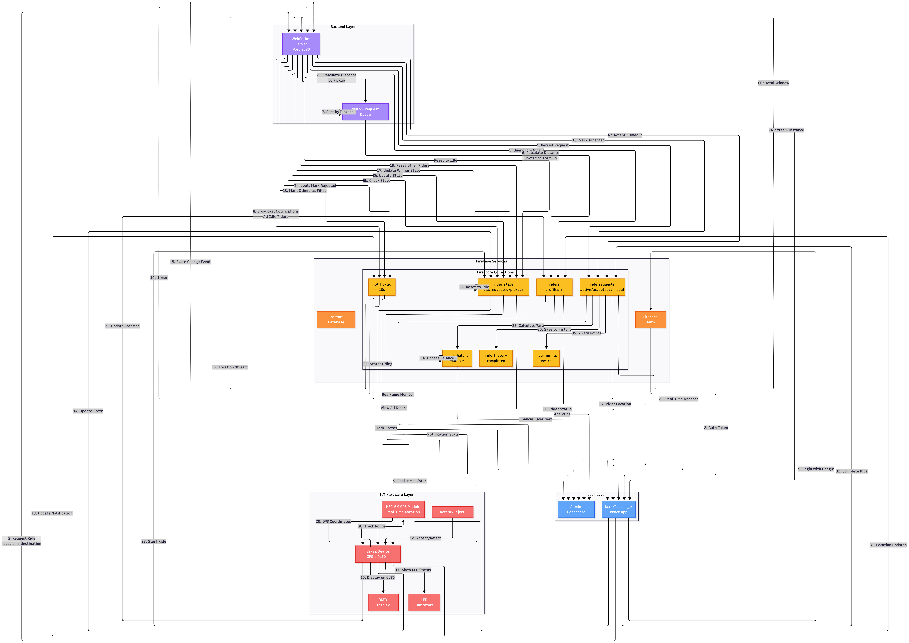

# Rixa Data Flow Diagram

## System Overview

The Rixa system consists of four main layers that work together seamlessly to provide real-time rickshaw ride matching and tracking.

### Architecture Layers

1. **User Layer** - React-based web application
2. **Backend Layer** - WebSocket server with custom queue
3. **Firebase Services** - Real-time database and authentication
4. **IoT Hardware Layer** - ESP32 devices with GPS and display

## Data Flow Steps

### 1. Ride Request Flow (Steps 1-8)
- User authenticates via Google OAuth
- User requests ride with pickup and destination
- WebSocket server persists request to Firestore
- Server queries idle riders and calculates distances
- Broadcasts notifications to all idle riders (sorted by distance)

### 2. Notification & Response (Steps 9-14)
- ESP32 devices listen for notifications in real-time
- OLED displays ride details
- LED indicators show status
- Rider accepts/rejects via physical button
- Updates flow back to Firestore

### 3. Assignment & Acceptance (Steps 15-19)
- First acceptance triggers assignment
- Request marked as accepted
- Winner's state updated to "pickup"
- Other notifications marked as "filled"
- Non-accepting riders reset to idle

### 4. Real-time Tracking (Steps 20-27)
- GPS module continuously updates location
- ESP32 sends coordinates to Firestore
- WebSocket streams distance calculations
- User sees live rider location and ETA
- Real-time state synchronization

### 5. Ride Execution (Steps 28-31)
- Ride starts when pickup confirmed
- State changes to "riding"
- GPS tracks entire route
- Continuous location updates

### 6. Completion & Payment (Steps 32-37)
- User marks ride complete
- System calculates fare based on distance/time
- Rider balance updated (+৳)
- Reward points awarded
- Ride saved to history
- Rider state reset to idle

### 7. Timeout Mechanisms
- Per-notification timeout: 10 seconds
- Total request window: 60 seconds
- Auto-reset riders to idle on timeout
- Request marked as timeout if no acceptance

### 8. Admin Monitoring
- Real-time dashboard for all operations
- Live rider tracking
- Financial analytics
- System health monitoring

## Key Features

### Real-time Synchronization
Firebase Firestore onSnapshot listeners provide instant updates across all connected devices without polling.

### Geospatial Queries
Haversine distance calculation formula determines proximity between users and available riders.

### Broadcast Assignment
All idle riders receive notifications simultaneously, sorted by distance, with first-to-accept winning the ride.

### Smart Timeouts
Individual 10-second timeouts per rider and global 60-second window for the entire request ensure efficient assignment.

### Bi-directional Communication
WebSocket for ride requests and Firebase for real-time data synchronization provide robust connectivity.

### IoT Integration
ESP32 microcontroller with GPS module, OLED display, and physical button controls for rider interactions.

## Firestore Collections

### 1. ride_requests
Stores all ride requests with states: active, accepted, timeout

### 2. riders
Rider profiles and real-time GPS locations updated by ESP32

### 3. rider_state
Tracks rider availability: idle, requested, pickup, riding

### 4. notifications
Manages ride notifications with 10-second timeout logic

### 5. rider_balance
Stores rider wallet balance in Bangladeshi Taka (৳)

### 6. rider_points
Manages reward points system for completed rides

### 7. ride_history
Complete history of all rides with earnings and status

## Technology Stack

- **Frontend**: React + TypeScript + Vite + Tailwind CSS
- **Backend**: Node.js WebSocket Server (Port 8080)
- **Database**: Firebase Firestore (Real-time NoSQL)
- **Authentication**: Firebase Auth with Google OAuth
- **IoT**: ESP32 + NEO-6M GPS + 0.96" OLED Display
- **Communication**: WebSocket (ride requests) + Firebase (data sync)
- **Geolocation**: Google Maps API + Haversine formula
- **UI Components**: shadcn/ui + Radix UI

## Assignment Algorithm

The system uses a broadcast-based assignment strategy:

1. All idle riders receive notifications simultaneously
2. Riders sorted by distance (nearest first)
3. First rider to accept gets the ride
4. Individual 10-second timeout per notification
5. 60-second total window for the entire request
6. Non-responding riders automatically reset to idle
7. Once accepted, all other active notifications marked as "filled"

This approach maximizes efficiency while ensuring the nearest available rider gets priority.

## Real-time Features

### Location Tracking
- GPS updates every 2-3 seconds
- Haversine distance calculations
- Live ETA updates to user
- Route history persistence

### State Management
- Rider states: idle → requested → pickup → riding → idle
- Real-time synchronization via Firebase listeners
- Automatic cleanup on timeouts

### Notifications
- Push to ESP32 via Firebase listeners
- OLED display with ride details
- LED status indicators
- Physical button for accept/reject

## Security & Authentication

- Google OAuth for user authentication
- Firebase Security Rules for data protection
- User-specific read/write permissions
- Authenticated API endpoints
- Secure WebSocket connections
